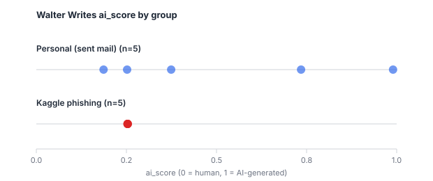

# Walter Writes Calibration Report

*Run 2026-09-01. Experiment only — no Layer 3 code was written or wired in.*

## 1. Objective

Establish whether Walter Writes' `ai_score` is reliable enough to become a
Tycoon2FA Layer 3 signal. The earlier connectivity probe scored one clearly
human-written sample at **0.9157 / `result: "ai"`**, which is the kind of
result that, left unexamined, becomes a systematic false positive in
production. One sample is not a finding, so this experiment scores a small
controlled set and asks: does `ai_score` separate human-written text from
machine-generated text at all?

This matters because of how Layer 3 would feed scoring. `scoring.composite`
takes the **maximum** signal score within a layer and weights L3 at **0.20**.
A signal that returns high values on ordinary human email would raise the
composite on ordinary human email — the exact failure mode the architecture's
completed/incomplete discipline exists to avoid elsewhere.

## 2. Test Set

| Group | Count | Description |
|---|---:|---|
| Personal | 5 | Real human-written emails — the operator's own **Sent** mail |
| Kaggle phishing | 5 | Phishing emails from the dataset |
| Kaggle legitimate | 0 tested (5 skipped) | None reach the API's 50-word minimum |

**Phishing/legitimate is NOT equivalent to AI/human.** The dataset labels an
email-security class only. It carries no authorship label, and nothing here
treats it as one.

Two deviations from the original design, both forced by the data and both
agreed before the run:

- **Personal samples are Sent mail, not received mail.** The 60 newest inbox
  messages contained no human-written email at all — every one carried a
  `List-Unsubscribe` header or a no-reply sender, including all three tagged
  `CATEGORY_PERSONAL`. Scoring automated marketing copy and calling the result
  a human false-positive rate would be meaningless, since much marketing copy
  genuinely is AI-drafted. Sent mail is the only sample here whose human
  authorship is directly attributable.
- **No Kaggle legitimate emails were sent.** Their maximum length is 37 words,
  below the API's hard 50-word minimum. All five are recorded as
  `skipped_below_50_words` and were not padded.

## 3. Results

| ID | Source | Class | Words | AI Score | Walter Result | Sentence Min | Sentence Max |
|---|---|---|---:|---:|---|---:|---:|
| PERSONAL-01 | personal | personal | 115 | **0.9900** | ai | 0.9998 | 1.0000 |
| PERSONAL-02 | personal | personal | 51 | 0.2520 | human | 0.0840 | 0.1514 |
| PERSONAL-03 | personal | personal | 177 | 0.3742 | human | 0.0028 | 0.8000 |
| PERSONAL-04 | personal | personal | 257 | 0.1866 | human | 0.0011 | 0.9960 |
| PERSONAL-05 | personal | personal | 110 | **0.7347** | ai | 0.0851 | 0.9999 |
| KAGGLE-PHISH-01 | kaggle | phishing | 52 | 0.2534 | human | 0.0534 | 0.0534 |
| KAGGLE-PHISH-02 | kaggle | phishing | 52 | 0.2534 | human | 0.0534 | 0.0534 |
| KAGGLE-PHISH-03 | kaggle | phishing | 51 | 0.2532 | human | 0.0532 | 0.0533 |
| KAGGLE-PHISH-04 | kaggle | phishing | 51 | 0.2532 | human | 0.0532 | 0.0533 |
| KAGGLE-PHISH-05 | kaggle | phishing | 51 | 0.2532 | human | 0.0532 | 0.0533 |

All ten returned HTTP 200. No email bodies, subjects, addresses or message ids
appear in this report or in any file it was generated from.

**Skipped (`skipped_below_50_words`)** — not sent to the API:

| ID | Words | Reason |
|---|---:|---|
| KAGGLE-LEGIT-01 … 05 | 37 each | Below the API's 50-word minimum |

## 4. Group Statistics

| Statistic | Personal | Kaggle phishing | Kaggle legitimate |
|---|---:|---:|---:|
| n tested | 5 | 5 | 0 |
| Mean | 0.5075 | 0.2533 | — |
| Median | 0.3742 | 0.2532 | — |
| Minimum | 0.1866 | 0.2532 | — |
| Maximum | 0.9900 | 0.2534 | — |
| Std. deviation | 0.3429 | 0.00008 | — |

Counts over illustrative thresholds:

| Threshold | Personal | Kaggle phishing |
|---|---:|---:|
| ≥ 0.50 | 2 / 5 | 0 / 5 |
| ≥ 0.70 | 2 / 5 | 0 / 5 |
| ≥ 0.90 | 1 / 5 | 0 / 5 |

**These thresholds are descriptive only.** They are not validated production
thresholds and nothing here justifies treating them as such.

## 5. Personal Email False-Positive Analysis

| Measure | Value |
|---|---:|
| Mean | 0.5075 |
| Median | 0.3742 |
| Maximum | 0.9900 |
| Count ≥ 0.70 | 2 / 5 |
| Count ≥ 0.90 | 1 / 5 |

Two of five emails the operator wrote themselves were labelled `"ai"` by
Walter, one at 0.99 with every sentence scored 0.9998–1.0000. On this sample
that is a 40% rate at a 0.70 threshold and 20% at 0.90 — high enough that,
wired into scoring as-is, it would fire on ordinary correspondence.

**The scores are also bimodal rather than borderline.** Three emails sat at
0.19–0.37 and two at 0.73–0.99, with a standard deviation of 0.34. Walter is
not hedging on these; it is confidently splitting one person's own writing
into two classes.

One alternative explanation must be stated rather than assumed away: **it is
not independently verified that all five were composed without LLM
assistance.** If PERSONAL-01 or PERSONAL-05 were drafted or rewritten with an
LLM, a high score is correct and not a false positive. Only the author can
resolve that, and it is the single cheapest thing that would sharpen this
result.

**n=5 cannot establish a production false-positive rate.** It cannot establish
a rate at all. What it does show is that high scores on genuine human email
are easy to produce — the probe found one, and this experiment found two more
in five attempts.

## 6. Phishing vs Legitimate

The comparison the experiment was designed to make is unavailable: no
legitimate email reached the 50-word minimum, so there is nothing to compare
the phishing group against.

What the phishing group did show is more interesting than the intended
comparison:

- All five scored **0.2532–0.2534**, a spread of 0.0002. Sentence-level scores
  were 0.0532–0.0534 across all fifteen sentences.
- All five were labelled `"human"`.
- Yet these texts are **machine-generated**. The corpus is templated: of 10,000
  rows only 500 reach 50 words, all of a single `phishing_type`
  (`social_engineering_advanced`), and those 500 rows contain just **6 unique
  texts**. A first selection drew five rows that were 97–100% similar, two of
  them byte-identical; the reported five are the deduplicated maximum the
  corpus can offer and are still ~97% similar to each other.

So on this sample the detector assigned **lower** AI scores to demonstrably
machine-generated text (0.25) than to demonstrably human-written text (up to
0.99). Nothing here suggests Walter behaves differently on phishing versus
legitimate mail; the phishing group is effectively a single text measured five
times, and its near-zero variance reflects that, not detector stability.

## 7. Findings

**Directly observed**

1. Two of five emails written by the operator scored ≥0.70 and were labelled
   `"ai"`; one scored 0.99 with all sentences ≥0.9998.
2. All five machine-generated phishing texts scored 0.2532–0.2534 and were
   labelled `"human"`.
3. Whole-text `ai_score` is not the mean of the sentence scores — PERSONAL-04
   returned 0.1866 whole-text despite a 0.9960 sentence maximum, and the
   phishing rows returned 0.2533 whole-text from sentences scoring 0.0533. The
   aggregation rule is undocumented and not reconstructable from the response.
4. The API throttles at roughly **5 requests per minute**, returning HTTP 429
   with the wait stated only in the JSON body ("Expected available in 57
   seconds"). No `Retry-After` or `X-RateLimit-*` headers are sent. Throttled
   requests consumed no credits.
5. Every legitimate email in the corpus (max 37 words) falls below the API's
   50-word floor.

**Reasonable interpretation**

6. On this sample `ai_score` shows no usable separation between human-written
   and machine-generated text, and what separation exists points the wrong
   way. A detector whose scores invert against ground truth cannot be
   corrected by choosing a better threshold.
7. The 50-word floor is a structural limit, not an edge case. The corpus's mean
   email is 37 words; short phishing messages are common, and Layer 3 would
   abstain on a large fraction of real traffic.

**Too small to conclude**

8. No false-positive *rate* can be derived from n=5. "2 of 5" is an
   observation, not a rate.
9. Whether the two high-scoring personal emails are true positives (LLM-assisted
   drafting) or false positives is unresolved.
10. The phishing group is ~n=1 by content. Nothing about Walter's behaviour on
    real, varied phishing mail follows from it.

## 8. Recommendation for Layer 3

### NOT SUITABLE AS A SCORING SIGNAL — in its current form

Not merely unproven: on this sample the signal is **inverted**. Machine-generated
text scored 0.25 and human-written text scored up to 0.99. A threshold cannot
repair a detector that ranks the two classes the wrong way round, so the usual
mitigation — "use it only above a high threshold" — does not apply here.

The architectural consequence is concrete. `scoring.composite.layer_score`
takes the maximum signal in a layer and L3 carries weight 0.20. A 0.99 on a
human-written email would contribute 0.198 to the composite on its own, and
more once L2/L4 remain unimplemented and L3's weight is renormalised upward —
with only L1 and L3 completing, L3's share rises to 0.40, so a single false
0.99 would add ~0.40 and push an otherwise clean message into the MEDIUM band
by itself.

**This is a recommendation about wiring it into scoring, not about abandoning
it.** A defensible next step is to keep the provider behind the planned
`AITextDetector` seam, emit the signal with `score=0.0` and the probability in
metadata only, and revisit once there is real evidence. To overturn this
recommendation, a larger calibration would need to show: (a) confirmed-human
email scoring consistently low, and (b) confirmed-LLM text scoring higher than
confirmed-human text. Finding (2) above currently contradicts (b).

## 9. API / Cost Notes

| Item | Value |
|---|---|
| Endpoint | `POST https://developer-portal.walterwrites.ai/api/detector/` |
| Auth | `X-API-Key` header (value never printed, logged or committed) |
| Words submitted (10 reported samples) | 967 |
| Credits consumed, whole session | ~1,245 (1,682 → 437 remaining) |
| Billing | ≈1 credit per word; the provider's own word count differs slightly from a naive `split()` |
| API errors | 5 × HTTP 429 (throttling); 1 × HTTP 400 `service_error` "All detector services failed" on a repeated-token payload |
| Latency (successful calls) | 515 ms min, 3,841 ms max, ~1,268 ms mean |
| Rate limit | ~5 requests/minute; stated only in the 429 body, no headers |

The ~1,245 credits exceed the 967 reported words because they include the
initial probe, the discarded near-duplicate phishing run, and contract-discovery
calls.

## 10. Limitations

- Only **5 personal emails**, and they are Sent mail rather than received mail.
- Only **5 phishing samples**, which are ~97% similar to one another — the
  corpus offers just 6 unique texts above 50 words, so this is close to n=1.
- **0 legitimate emails tested**; all fell below the 50-word minimum.
- Dataset labels are **phishing/legitimate, not AI/human authorship**.
- **No independent ground truth for AI-generation status** on any sample. The
  personal emails are assumed human-authored because the operator wrote them;
  LLM assistance was not ruled out.
- The Kaggle corpus is itself **machine-generated**, so it is not valid
  human-written ground truth — a fact that inverts how finding (2) should be
  read.
- **Walter's published documentation was inaccessible** during both the probe
  and this run (Cloudflare 403 on `docs.walterwrites.ai`,
  `walterwrites.ai/ai-detector-api/` and `platform.walterwrites.ai`). The
  contract, the 50-word floor and the rate limit were all derived from live API
  responses. Score semantics, the whole-text aggregation rule, model version and
  data-retention policy remain undocumented.
- **This experiment cannot establish a production threshold**, and no number in
  it should be treated as one.

